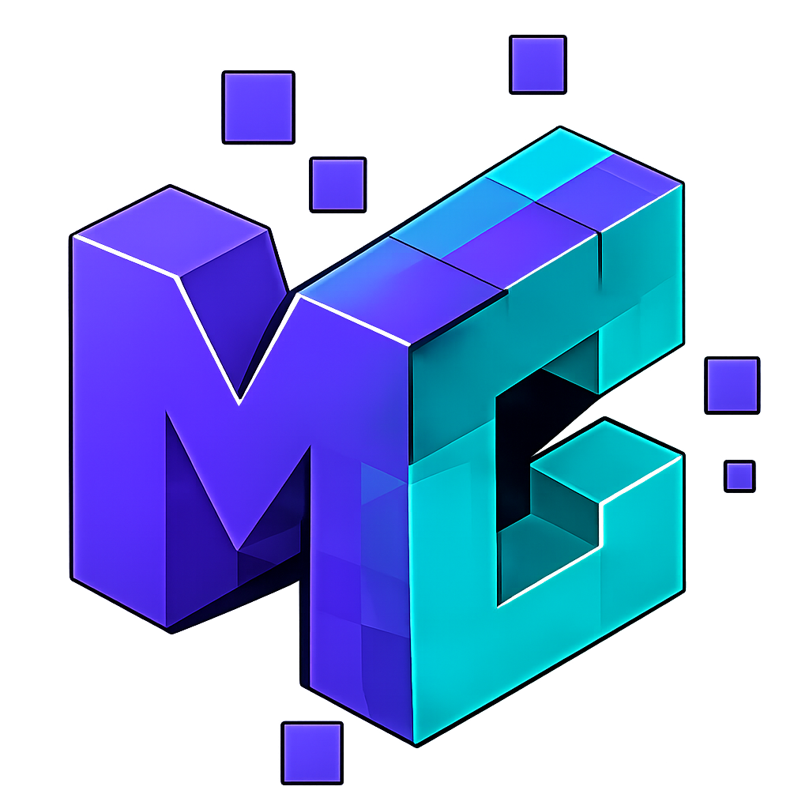

# MuleAcademy


Uma plataforma didática, interativa e gamificada para ensinar fundamentos de integração de sistemas, APIs, formatos de dados e conceitos de MuleSoft para iniciantes em tecnologia.

O projeto combina aulas visuais, simuladores, desafios práticos, progresso por módulos e uma interface futurista com background animado para tornar o aprendizado mais envolvente.

## Acesse

[Abrir o curso online](https://ricardo-maciel.github.io/MULE-ACADEMY/dashboard.html)

> [!TIP]
> **Credenciais de Teste para Estudos:**
> - **E-mail:** `estudo@email.com`
> - **Senha:** `user123`
>
> *Caso prefira, você também pode utilizar a opção **"Criar conta"** diretamente na tela inicial para registrar um novo usuário para seus estudos. Todo o progresso do curso ficará salvo localmente no seu navegador (`localStorage`).*

## Sobre o Projeto

O MuleAcademy foi criado para transformar conceitos abstratos de integração em experiências práticas. Em vez de apenas explicar o que é uma API, o curso mostra por que sistemas precisam conversar, como dados trafegam, onde surgem falhas e como uma arquitetura centralizada ajuda a organizar esse fluxo.

A trilha foi pensada para quem está começando e precisa construir uma base visual antes de entrar em ferramentas corporativas mais complexas.

## Principais Recursos

- **Controle de Acesso Flexível:** Sistema de login, cadastro de estudantes e portal de administração com sessão via `sessionStorage` e persistência via `localStorage`.
- **Painel Administrativo Embutido:** Acesso restrito para administradores (`admin@curso.com`) com visualização de métricas (total de alunos, alunos ativos, conclusões), gerenciamento de usuários (cadastro, edição, exclusão, bloqueio de acesso) e logs de auditoria detalhados com decodificação amigável de navegador e OS.
- **Dashboard de Progresso:** Painel interativo com status visual de cada módulo da trilha de aprendizado, liberando módulos sequencialmente conforme conclusão dos anteriores.
- **Aulas Interativas:** Conteúdo teórico estruturado com navegação fluida por capítulos.
- **Simuladores de Integração Prática:** Laboratórios visuais e simuladores práticos de APIs, payload JSON, conversão XML, requisições HTTP e logs.
- **Playground de Arquitetura com Telemetria:** Simulador físico de arrastar e soltar (drag and drop) que compara na prática o acoplamento caótico Ponto a Ponto (P2P) com a arquitetura centralizada (Hub-and-Spoke com MuleSoft), exibindo estatísticas em tempo real de latência, esforço de manutenção, número de conexões e riscos de falha.
- **Scanner de Tecnologias Simulado:** Ferramenta no Playground que simula uma varredura de sistemas na rede da empresa (com efeito visual de laser e presets de cenários como e-commerce, CRM e ERP).
- **Efeitos Sonoros Dinâmicos:** Efeitos de sucesso, erro, scanner e interações sintetizados diretamente no navegador via **Web Audio API**.
- **Background Animado e Interativo:** Motor Canvas com efeito de constelação tecnológica que responde à movimentação do cursor.
- **Design de Alta Qualidade:** Visual dark futurista, glassmorphism e micro-animações responsivas desenvolvidas inteiramente em CSS puro.

## 🎨 Identidades Visuais

A plataforma tem **duas identidades visuais** que você escolhe na tela de login — só muda a aparência, o conteúdo e o progresso são exatamente os mesmos nas duas.

| | Identidade | Visual |
|---|---|---|
|  | **MuleCraft** *(padrão)* | Tema roxo e ciano, estilo tech corporativo. Ideal para um ambiente mais profissional e sóbrio. |
| 🐴 | **Mule Sem Freio** | Tema laranja vibrante com mascote. Estilo mais descontraído e divertido. |

> 💡 Trocar de identidade não apaga nem altera nenhum dado. O aluno pode estudar com qualquer uma e continuar de onde parou normalmente.

---

## ⚡ Modo Desempenho

Controla a intensidade dos efeitos visuais do background (constelação animada, spotlight do cursor, sombras). Útil para adaptar a experiência ao hardware do dispositivo.

| Modo | Ícone | O que faz |
|---|---|---|
| **Normal** | ⚡ | Todos os efeitos ativos — experiência visual completa. |
| **Médio** *(padrão)* | ✨ | Efeitos reduzidos e sombras mais leves — bom equilíbrio entre visual e performance. |
| **Máximo** | 🖥️ | Animações de fundo desativadas — para máquinas mais lentas ou foco total no conteúdo. |

> 💡 A preferência fica salva automaticamente. Na próxima visita, o modo escolhido é restaurado.

## Trilha de Aprendizado

### Módulo 1: Comunicação entre Sistemas

Introduz o problema de sistemas isolados e mostra por que empresas precisam integrar softwares para automatizar processos e reduzir retrabalho.

### Módulo 2: JSON, XML e CSV

Apresenta os principais formatos de troca de dados, com comparações visuais, exercícios de sintaxe e validação prática.

### Módulo 3: O Caos do Espaguete

Mostra como conexões ponto a ponto crescem em complexidade e tornam a manutenção difícil conforme novos sistemas entram no ecossistema.

### Módulo 4: MuleSoft como Hub Central

Explica a arquitetura centralizada, com sistemas conectados a um hub responsável por organizar fluxos, traduções e isolamento de falhas.

### Módulo 5: Mission Control

Simulador em formato de jogo onde o aluno acompanha pipelines, payloads, status HTTP, logs, falhas e retentativas em um cenário inspirado em e-commerce.

## Tecnologias

- **HTML5** para estrutura semântica das telas e controle de redirecionamentos.
- **CSS3** para o layout moderno (glassmorphism), responsividade avançada e micro-animações interativas.
- **JavaScript (ES6+)** para o motor de física de partículas, lógica dos simuladores, auditoria, controle de sessão e manipulação dinâmica de DOM.
- **Web Audio API** para a geração/síntese de áudio e efeitos sonoros retrofuturistas em tempo real, sem necessidade de carregar arquivos MP3/WAV pesados.
- **Canvas API** para renderização de redes de partículas e conexões interativas tanto no background quanto na simulação do playground.
- **SVG** para ilustrações e fluxogramas explicativos com animações integradas.
- **Lucide Icons** para a iconografia rica e consistente da interface.
- **LocalStorage & SessionStorage** para controle de sessão ativo, persistência de banco de dados mockado localmente e histórico de logs.

## Estrutura

```text
MULESOFT/
├── login.html              # Acesso, cadastro e Portal Administrativo integrado
├── dashboard.html          # Painel principal do aluno
├── index.html              # Módulo 1
├── modulo2.html            # Módulo 2
├── modulo3.html            # Módulo 3
├── modulo4.html            # Módulo 4
├── modulo5.html            # Módulo 5
├── playground.html         # Playground interativo
├── *.css                   # Estilos específicos das telas
├── *.js                    # Lógica das telas e simuladores
├── tech-background.css     # Estilo do background global
└── tech-background.js      # Motor Canvas do background interativo
```

## Como Executar Localmente

Como o projeto é estático, basta abrir `login.html` no navegador.

Também é possível servir a pasta localmente:

```bash
python -m http.server 4173
```

Depois acesse:

```text
http://127.0.0.1:4173/login.html
```

## Créditos

Projeto idealizado e criado por **Ricardo Maciel**.

Desenvolvido com apoio de ferramentas de inteligência artificial para acelerar prototipação, interface, escrita e refinamento da experiência.
